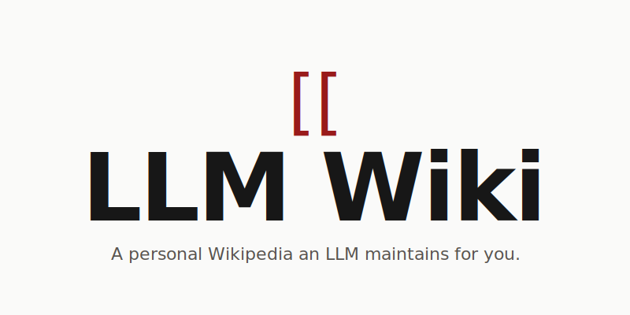
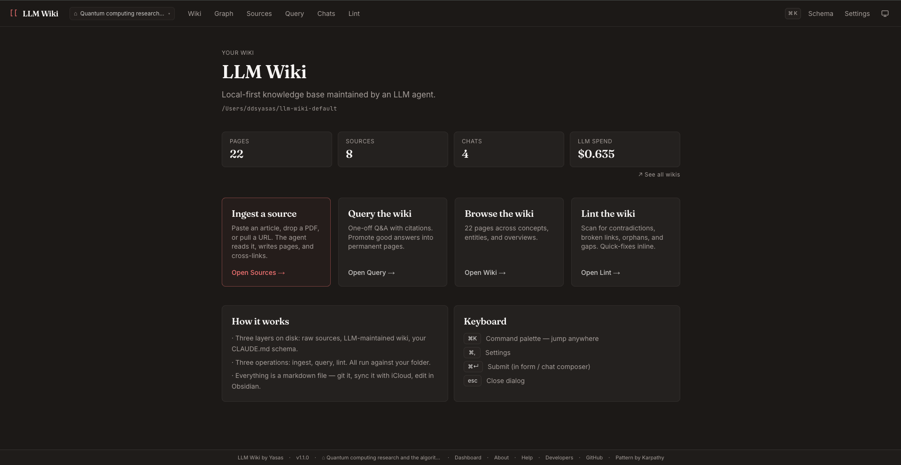
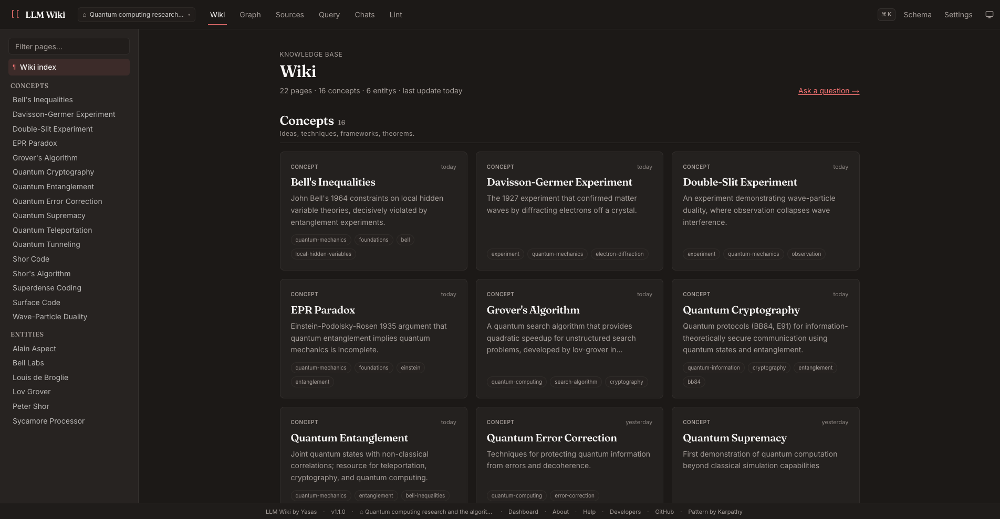
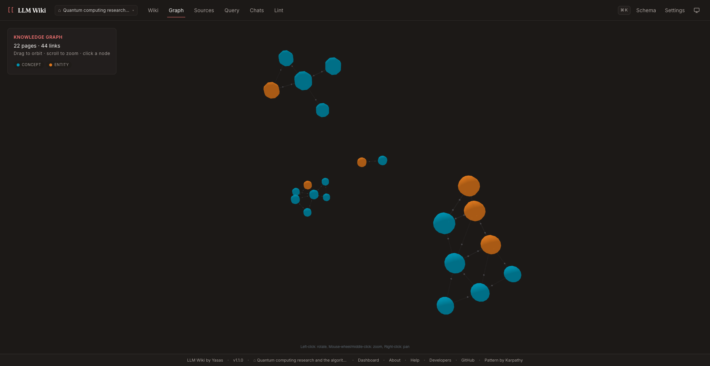
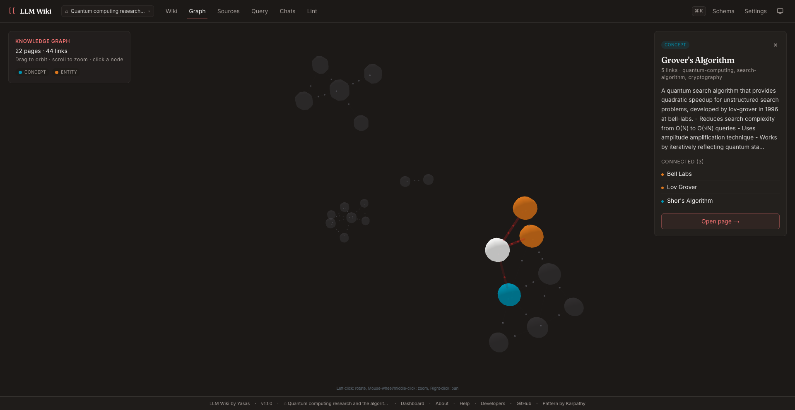
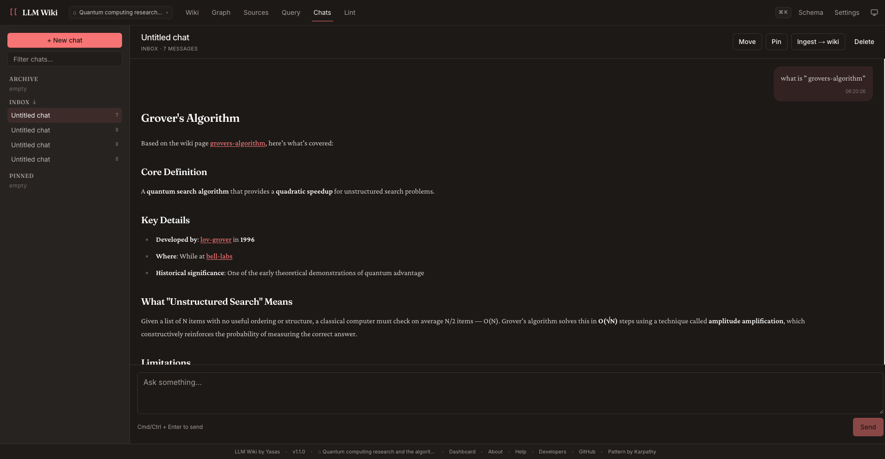
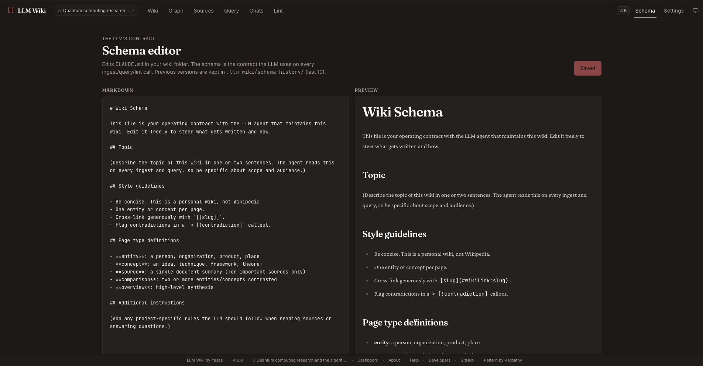
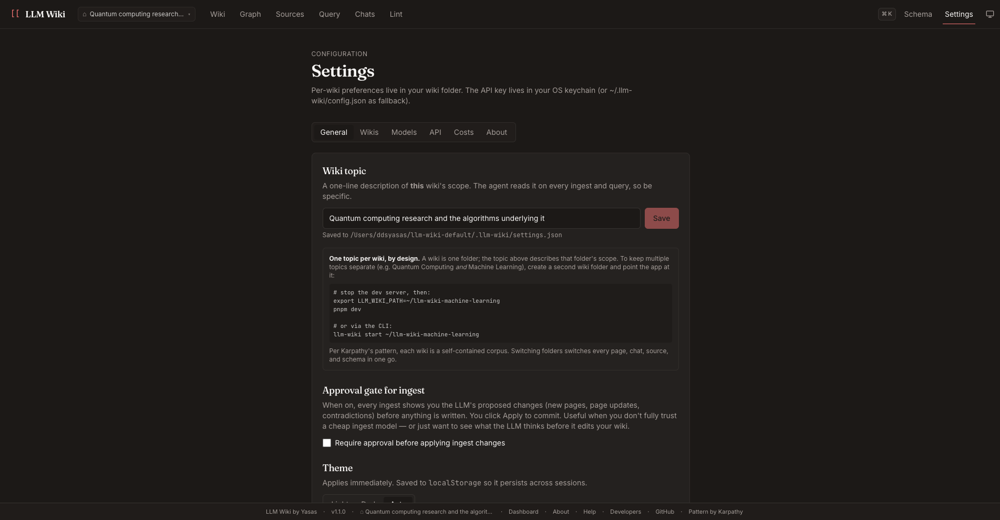
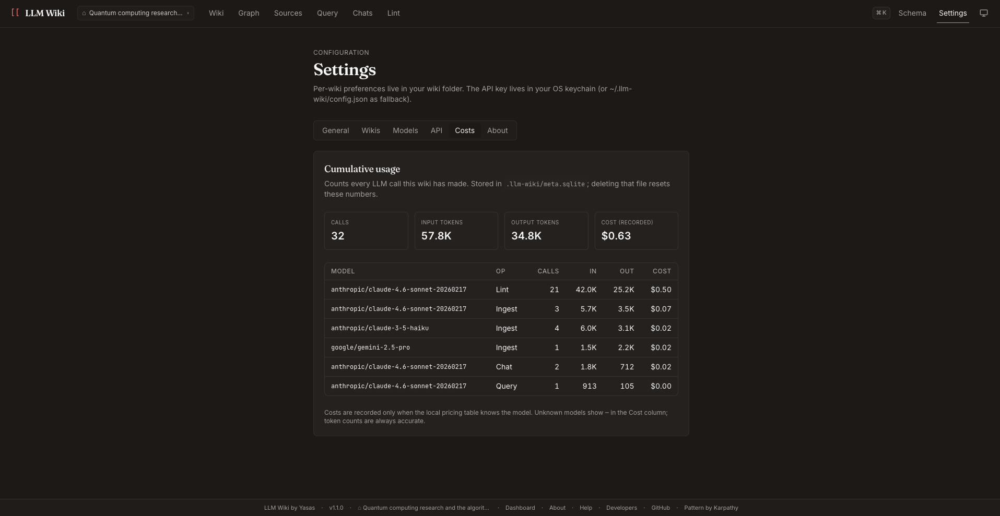
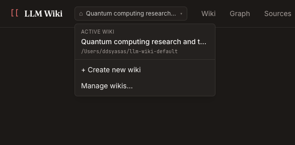

<p align="center">
  
</p>

<h1 align="center">LLM Wiki</h1>

<p align="center">
  <strong>A personal Wikipedia an LLM maintains for you.</strong><br>
  Drop in articles, papers, notes, PDFs, or URLs — an agent compiles them into a cross-linked markdown wiki you fully own. Knowledge compounds: each new source makes every page richer, not just one new page longer.
</p>

<p align="center">
  Open source · Local-first · Bring-your-own-key · MIT · v1.2.3
</p>

<p align="center">
  <a href="https://llmwiki.cc"></a>
  <a href="https://www.npmjs.com/package/@syasas/llm-wiki"></a>
  <a href="https://github.com/ddsyasas/llm-wiki/blob/main/LICENSE"></a>
  <a href="https://github.com/ddsyasas/llm-wiki/releases/latest"></a>
  <a href="https://github.com/ddsyasas/llm-wiki/blob/main/CONTRIBUTING.md"></a>
</p>

This is a from-scratch implementation of [Andrej Karpathy's LLM Wiki pattern](https://gist.github.com/karpathy/442a6bf555914893e9891c11519de94f), released April 2026.

---

## Why this exists

| Existing tools | What they miss |
|---|---|
| **RAG chat** (NotebookLM, ChatGPT files) | Stateless. Rediscovers your corpus from scratch on every query. Never accumulates anything you can read later. |
| **Note-taking apps** (Obsidian, Notion) | All the maintenance burden on the human. You write, you cross-link, you check for contradictions. Nothing scales. |
| **LLM Wiki** | Sits between them. The LLM does the maintenance; the wiki accumulates value; you own the markdown files. |

After a few weeks of feeding it sources, you have a navigable, cited, deliberately-organized body of knowledge about whatever you care about — without ever having written a page yourself.

---

## Screenshots



*Home — per-wiki page / source / chat counts, cumulative LLM spend (click → cross-wiki dashboard), and the four primary actions. Footer chips reach every meta-surface (About, Help, Developers, Dashboard).*

### The wiki layer



*`/wiki` — pages grouped by type (Concepts, Entities, Comparisons, Overviews). Sidebar has search + filter; clicking any card opens the page with backlinks and source lineage.*


*`/graph` — every page and every `[[wikilink]]` as a 3D force-directed network, colored by page type. Drag to orbit, scroll to zoom, click any node to focus.*


*Clicking a node opens a side panel: outgoing links, full summary, connected pages. "Open page →" jumps to the wiki view of that node.*

### Operations


*`/chats/[id]` — multi-turn conversations over your wiki, saved as plain markdown in `chats/`. "Ingest → wiki" promotes the conversation into permanent pages; per-message "Save as wiki page" promotes a single answer.*


*`/schema` — edit `CLAUDE.md` (the LLM's operating contract) with a split-pane markdown editor + live preview. Auto-backup to `.llm-wiki/schema-history/` on every save.*

### Settings + multi-wiki


*`/settings` — one-line wiki topic (the LLM reads this on every operation), optional approval gate for ingest, theme picker, default models per operation slot.*


*`/settings → Costs` — cumulative tokens + spend per (model, operation) pair. The `Cost (recorded)` column populates as new LLM calls land; historical rows get backfilled from the pricing table on next startup.*


*Header chip → dropdown with the active wiki (topic + folder path), plus quick links to Create / Manage. Same actions are reachable from `⌘K` ("Switch to…" group) and `/dashboard` (per-wiki cards with Switch buttons).*

---

## What's in v1.2

> **Recent patches:**
> - **v1.2.3** *(2026-05-27)* — **free OpenRouter models** added to the Settings → Models dropdown (Llama 3.3 70B, Nemotron Super 120B, DeepSeek V4 Flash, Gemma 4 31B). Settings banner explains rate-limit + data-retention tradeoffs. First-run wizard gained a one-click *"Use free models by default"* toggle so the cost-to-first-ingest is zero. ([release](https://github.com/ddsyasas/llm-wiki/releases/tag/v1.2.3))
> - **v1.2.2** *(2026-05-26)* — CLI now prints an update-available banner on `llm-wiki start` when a newer version is on npm. Cached on disk, refreshed in the background, silenced by `NO_UPDATE_NOTIFIER=1` or `--quiet`. ([release](https://github.com/ddsyasas/llm-wiki/releases/tag/v1.2.2))
> - **v1.2.1** *(2026-05-26)* — fixes two regressions from the v1.2.0 Ollama refactor: the Sources/Query pages crashed the moment text was typed/pasted, and PDF ingest failed with `Cannot read properties of undefined (reading '0')`. PDFs now ride OpenRouter's `type: "file"` contract; settings types match runtime. ([release](https://github.com/ddsyasas/llm-wiki/releases/tag/v1.2.1) · [known-issues thread](https://github.com/ddsyasas/llm-wiki/issues/3))

### The three operations (Karpathy's pattern)

- **Ingest** — Drop a source (text / file / URL / PDF / image) → the LLM reads it + your existing wiki, writes new pages, updates older pages where context shifts, refreshes the index, logs the change. Each ingest is a *refactor pass*, not an append.
- **Query** — One-shot Q&A against the whole wiki with cited pages. "Save as wiki page" promotes useful answers into permanent entries.
- **Lint** — Two-pass health check: local scan (broken links, orphans) + LLM pass (contradictions, gaps, stale claims, missing pages). Every issue ships with **one-click fixes** — including LLM-powered ones that write the page edit for you.

### Workflow features

- **Sources page** — Add via paste, drag-and-drop, or URL. Auto-detects format. Cost preview before every ingest. Per-source detail view shows the raw text, contributing wiki pages, and metadata.
- **Wiki landing** — Cards grouped by type (Overviews → Concepts → Entities → Comparisons → Sources). Search/filter sidebar. Click any card → page view with backlinks + source lineage + inline edit.
- **3D Graph view** *(new in v1.0)* — Force-directed graph of every page and every `[[wikilink]]`. Same engine as Obsidian's 3D Graph plugin, but colored by **page type** (not free-form tag), so the structure of your knowledge is visible at a glance. Click-to-focus reveals neighbors; drag/scroll to orbit; URL-state for deep links. Spec: [`docs/12-graph-view.md`](docs/12-graph-view.md).
- **Chats** — Multi-turn conversations saved as `.md` files in folders. Per-message "Save as wiki page" + whole-chat "Ingest → wiki" buttons close the loop from exploratory thinking back into the permanent layer.
- **Schema editor** — Edit the `CLAUDE.md` contract the LLM reads on every operation. Split-pane preview, auto-backup to `.llm-wiki/schema-history/`.
- **Log timeline** — `/log` shows every ingest / edit / lint / schema-save in chronological order. Wikilinks inside log entries are clickable.
- **Multiple wikis** — keep separate wikis for separate topics (e.g. "Physics", "ML research", "Personal KB"). Switch from the active-wiki chip in the header, the `Cmd+K` palette, or **Settings → Wikis** (full CRUD). Switching is in-place — you stay on whatever page you're on, the data refreshes around you. Spec: [`docs/13-multi-wiki.md`](docs/13-multi-wiki.md).
- **Wiki health dashboard** at `/dashboard` *(new in v1.x)* — cross-wiki overview: per-wiki page / source / chat counts, cumulative LLM spend, last-touched timestamps, sortable by recency. Roll-up totals at the top. One-click switch into any wiki.

### Quality / safety

- **First-run gate** — A real wizard collects the wiki topic + an LLM provider (OpenRouter API key OR a local Ollama install — see below) before letting you wander. No silent failures on first ingest.
- **Local models support (Ollama)** *(new in v1.2)* — first-class per-slot provider option in Settings → Models. Run any operation (ingest / query / chat / lint / vision) against a model on your own machine instead of OpenRouter. Free per query after the one-time model download, fully private (data never leaves your laptop). Dedicated `/local-models` setup guide in-app covers install + a hardware-requirements table mapping common models (llama3, mistral, phi3, llava, mixtral, llama3:70b, etc.) to RAM / disk / expected tokens-per-sec on Apple Silicon and CPU-only.
- **Page-history backups** — Every page edit (manual or LLM-driven) backs up the prior version to `.llm-wiki/page-history/`.
- **Cost transparency** — Estimated cost shown before every LLM operation; running cumulative tally in Settings → Costs.
- **Source lineage** — Every wiki page lists which raw sources it was compiled from; every source lists which wiki pages it contributed to. Bidirectional graph traversal.
- **Index integrity** — `index.md` auto-refreshes on every page edit. Click "Rebuild index" anytime for a full re-sweep.

### Settings

Five model slots tunable per-operation: `ingest` / `query` / `chat` / `lint` / `vision`. **Per-slot provider picker** *(new in v1.2)*: choose **OpenRouter** (cloud, BYOK, pay-as-you-go) or **Ollama (Local)** (your own machine, free) per slot — mix and match. Curated model dropdowns for each provider plus a custom-slug field for anything else. If any slot uses Ollama, a heads-up banner appears with a link to the `/local-models` setup guide. Light / dark / auto theme. OpenRouter key stored in OS keychain when available.

---

## The on-disk shape

```
~/llm-wiki-default/                  # your wiki folder (set with LLM_WIKI_PATH)
├── CLAUDE.md                        # the schema you edit at /schema
├── index.md                         # auto-maintained catalog of pages
├── log.md                           # every operation, browsable at /log
├── raw/                             # original source files, untouched
├── wiki/                            # LLM-maintained pages (Markdown + frontmatter)
├── chats/                           # chat threads as .md files
└── .llm-wiki/                       # SQLite metadata + page-history + schema-history
```

Everything is plain markdown. Delete the app, open the folder in Obsidian / VS Code / vim — your wiki still works.

---

## Install + run

Three paths. Pick one.

### Hosted — try without installing

The hosted version lives at **[llmwiki.cc](https://llmwiki.cc)**. No install, no Node, no OpenRouter account required to look around — sign up, click around, start ingesting. Currently in waitlist: hosted product launches as paid tiers when the waitlist signals demand. Join the list on the site if you want an email when it goes live.

For everyone who'd rather run it themselves (the local-first promise this project was built on stays untouched), the two install paths below are the canonical way:

### Quick start — install the CLI (recommended)

```bash
npm install -g @syasas/llm-wiki
llm-wiki start
```

That's it — no git clone, no monorepo, ~30 second install. The CLI auto-initializes your wiki folder, picks a free port (3737 by default), and opens the browser. Verified on **macOS / Linux (incl. WSL) / Windows**.

Package on npm: [npmjs.com/package/@syasas/llm-wiki](https://www.npmjs.com/package/@syasas/llm-wiki). Release notes + tarball mirror: [GitHub Releases](https://github.com/ddsyasas/llm-wiki/releases/latest). If npm is unavailable for some reason, you can install directly from the GitHub tarball: `npm install -g https://github.com/ddsyasas/llm-wiki/releases/download/v1.2.3/syasas-llm-wiki-1.2.3.tgz`.

### From source — for development or contributing

```bash
git clone https://github.com/ddsyasas/llm-wiki.git
cd llm-wiki
pnpm install
pnpm dev
```

Open `http://localhost:3000` → the first-run wizard collects your wiki topic + an LLM provider (OpenRouter API key, or set up a local [Ollama](https://ollama.com) install if you'd rather run models on your own machine) → you're in.

### Prerequisites

| Tool | Minimum | How to get it |
|---|---|---|
| **Node.js** | 20.x | [nodejs.org](https://nodejs.org) or `nvm install 20` (recommended) |
| **LLM provider** | one of: | Pick **either** an OpenRouter key OR a local Ollama install (or both — mix per-slot) |
| ↳ OpenRouter (cloud) | — | [openrouter.ai/keys](https://openrouter.ai/keys) — pay-as-you-go, ~$5 lasts most users 2-4 weeks at default models. Best quality (frontier Claude / GPT / Gemini). |
| ↳ Ollama (local) | — | [ollama.com/download](https://ollama.com/download) + `ollama pull llama3` (or similar). Free per query, runs on your machine. See in-app `/local-models` page for full install + hardware requirements per model. |
| **pnpm** *(source path only)* | 8.x | `npm install -g pnpm` |

Check with `node --version` before you start. **At least one LLM provider is required** — without either an OpenRouter key or a running Ollama, ingest / query / chat / lint all fail. If you only use Ollama, no OpenRouter key is needed.

### `llm-wiki: command not found` after install

The package installed fine — npm just put the binary somewhere your shell isn't looking. Common on WSL Ubuntu when Node was installed via apt with a non-standard npm prefix. Diagnostic:

```bash
# Find where npm put the binary
npm prefix -g

# Confirm it landed there
ls -la "$(npm prefix -g)/bin/llm-wiki"

# One-off: run via full path
"$(npm prefix -g)/bin/llm-wiki" doctor
```

Permanent fix (one-time):

```bash
echo 'export PATH="$(npm prefix -g)/bin:$PATH"' >> ~/.bashrc
source ~/.bashrc
llm-wiki doctor
```

(On zsh, swap `~/.bashrc` for `~/.zshrc`. On Windows PowerShell, `npm install -g` normally puts bins in `%AppData%\npm\` which is on PATH by default — if you hit this on Windows, run `npm config get prefix` and add `<that>/bin` to your user PATH via System Properties.)

### Per-OS install notes

**macOS** — verified end-to-end. Works out of the box with Node from nodejs.org or nvm. Xcode Command Line Tools are usually already present; if `npm install` complains: `xcode-select --install`.

**Linux** (Ubuntu / Debian / Fedora / Arch / WSL) — verified end-to-end. If `npm install -g` fails on the native deps (`better-sqlite3`, `keytar`), install build tools first:

```bash
# Debian / Ubuntu / WSL
sudo apt install build-essential python3 libsecret-1-dev

# Fedora / RHEL
sudo dnf install gcc-c++ make python3 libsecret-devel

# Arch
sudo pacman -S base-devel python libsecret
```

`libsecret` is what `keytar` talks to for the system keychain (GNOME Keyring, KWallet). Without it `keytar` still installs, but secret storage falls back to a chmod-600 file in `~/.llm-wiki/`.

**Windows** — verified end-to-end via PowerShell + Node 20. `keytar` uses Windows Credential Manager natively, no extra setup. If `npm install -g` fails on the native deps, install the *C++ build tools* component of [Visual Studio Build Tools 2022](https://visualstudio.microsoft.com/downloads/) — most recent Node versions skip this since prebuilt binaries are usually available.

**ChromeOS** — enable [Crostini Linux dev environment](https://chromeos.dev/en/linux), then follow the Linux path.

**Docker** — not officially shipped, but works fine: `node:20-bookworm` base image, install the tarball, bind-mount your wiki folder. PR with a Dockerfile welcome.

**Mobile (iOS / Android)** — not supported. LLM Wiki is a local server, not a packaged mobile app. The V2 Tauri installer (roadmapped) targets desktop OSes, not phones.

### Run the dev server

From the repo root:

```bash
pnpm dev
```

Output:

```
- Local:        http://localhost:3000
✓ Ready in 1.5s
```

First page load takes 10-30 seconds while Next compiles routes lazily — watch the terminal for `✓ Compiled / in XXXms`, then the page renders. Subsequent loads are instant.

To point at a wiki folder other than the default `~/llm-wiki-default`:

```bash
# macOS / Linux / WSL
export LLM_WIKI_PATH=~/my-research-wiki
pnpm dev

# Windows PowerShell
$env:LLM_WIKI_PATH = "C:\Users\you\my-research-wiki"
pnpm dev

# Windows cmd
set LLM_WIKI_PATH=C:\Users\you\my-research-wiki
pnpm dev
```

You can also switch wikis at runtime from **Settings → Wikis** without restarting the server.

### Using the CLI

After `npm install -g <tarball>`, the `llm-wiki` command is on your PATH globally:

```bash
# Start (uses current directory as the wiki folder)
llm-wiki start

# Start in a specific folder (auto-initializes it if empty)
llm-wiki start ~/research/quantum

# Initialize a folder as a wiki without starting the server
llm-wiki init ~/research/quantum

# Probe install + OpenRouter connectivity
llm-wiki doctor

# Full command + flag list
llm-wiki help
```

If you're working from source (didn't `npm install -g`), invoke via Node directly: `node apps/web/bin/llm-wiki.mjs <command>` — or use the workspace shortcut `pnpm --filter @llm-wiki/web cli -- <command>`.

The CLI defaults to port **3737** (vs. `pnpm dev`'s 3000) and auto-picks the next free port if it's taken. Brand-new directories become working wikis on first start — no separate `init` step required unless you want one.

**Flags**:

| Flag | Effect |
|---|---|
| `--port 4000` | Bind a specific port (also reads `LLM_WIKI_PORT` env var) |
| `--no-open` | Don't auto-launch the browser |
| `--quiet` | Suppress non-error logs |
| `--debug` | Verbose logs with stack traces |

**`doctor` output**:

```
$ llm-wiki doctor
Checking installation...
  ✓ llm-wiki version: 1.2.3
  ✓ Node version: v20.11.0
  ✓ Platform: darwin arm64

Checking config...
  ✓ Config dir: /Users/you/.llm-wiki
  ✓ OpenRouter API key set in config file (sk-or-v1...abc1)

Checking OpenRouter connectivity...
  ✓ Reachable
  ✓ API key valid (account: your-label)

Recent wikis:
  · /Users/you/research/quantum
  · /Users/you/llm-wiki-default

All checks passed. ✓
```

If `doctor` reports the API key as "NOT set in config file", that's expected — the app prefers the OS keychain for keys, which the CLI can't inspect from outside the running server. Use the Settings page in the browser to verify the keychain entry.

### Updating

**If you installed via `npm install -g`** (the canonical path):

```bash
npm install -g @syasas/llm-wiki@latest
llm-wiki version    # verify the new version landed
```

`@latest` pulls whatever the newest published version is. To upgrade to a specific version: `npm install -g @syasas/llm-wiki@1.2.3`.

If you have a `llm-wiki start` server already running, stop it first with `Ctrl+C` — npm can't replace a binary that's executing. After the install completes, `llm-wiki start` again to pick up the new code.

**Auto-discovery (v1.2.2+).** Once you're on v1.2.2 or newer, `llm-wiki start` checks npm for newer releases in the background and prints a yellow `Update available: X.Y.Z → A.B.C` banner above the server logs when one ships. Cached on disk (~24h) so it never slows startup. Silence with `NO_UPDATE_NOTIFIER=1` or `--quiet`. Useful so you find out about patch releases without having to check the repo manually.

**Your wiki data is safe across upgrades.** The on-disk format (markdown + SQLite metadata) is stable within v1.x — your folder, schema, pages, chats, history, OpenRouter key, and per-slot provider selections (OpenRouter or Ollama) all carry over. Database migrations (when any ship) run automatically on the next server start; no manual step. The v1.1.x → v1.2.0 settings-shape change (each model slot went from `string` to `{ provider, model }`) is handled by a backward-compat parser — your existing config keeps working unchanged.

**If you installed from source** (git clone path, for contributors):

```bash
cd /path/to/llm-wiki
git pull
pnpm install        # picks up any new deps
```

Then re-run `pnpm dev` (or however you start it). Same data-safety guarantees apply.

**If you installed from the GitHub release tarball directly** (without npm):

```bash
# Get the latest release URL from https://github.com/ddsyasas/llm-wiki/releases/latest
npm install -g https://github.com/ddsyasas/llm-wiki/releases/download/v1.2.3/syasas-llm-wiki-1.2.3.tgz
```

Replace `v1.2.3` / `1.2.3` with whichever version is current on the [releases page](https://github.com/ddsyasas/llm-wiki/releases/latest).

**Verifying the upgrade**:

```bash
llm-wiki version    # should print the new version
llm-wiki doctor     # confirm install + OpenRouter still healthy
                    # (doctor only probes OpenRouter — if you use Ollama,
                    #  verify it separately with: curl http://localhost:11434/api/version)
```

If `llm-wiki version` still prints the old number after upgrading, try opening a new terminal window — sometimes (especially on Windows) the shell needs to re-resolve the PATH after `npm install -g` replaces the binary.

### Building a publishable tarball

Want to package the app as a standalone npm tarball you can host yourself (or publish under your own scope)? After `pnpm install`:

```bash
pnpm --filter @llm-wiki/web build:publish    # produces apps/web/dist-publish/
cd apps/web/dist-publish
npm pack                                      # ~28MB tarball, fully self-contained
# or:
npm publish --access public                   # ship it to npm
```

The published artifact is a single package with one runtime dep (`open`, for browser auto-launch). Everything else — Next, React, native deps, workspace packages — is inlined into the standalone bundle. The bin field exposes the `llm-wiki` CLI verbatim.

### Uninstalling

The app is a Next.js server plus a SQLite metadata cache. To remove it:

```bash
# Remove the repo
rm -rf llm-wiki/

# Remove the global config (OpenRouter key file-fallback + recent-wiki list)
rm -rf ~/.llm-wiki/                           # macOS / Linux / WSL
Remove-Item -Recurse -Force $HOME\.llm-wiki   # Windows PowerShell

# Optionally delete the wiki folder itself (it's just markdown — you may want to keep it)
rm -rf ~/llm-wiki-default
```

If you used the OS keychain for your API key (the default), also delete the `llm-wiki` / `openrouter-api-key` entry from Keychain Access (macOS) / GNOME Keyring (Linux) / Credential Manager (Windows).

If you used Ollama and want to free disk space, also remove the downloaded models: `ollama list` to see them, `ollama rm <name>` per model, or uninstall Ollama itself (`brew uninstall ollama` on macOS) to remove everything in `~/.ollama/`.

Your wiki folder is plain markdown — keep it, open in Obsidian / VS Code / vim, sync with git or iCloud, archive it. The app leaving doesn't take your knowledge with it.

### Recovery / common gotchas

See [`docs/dev-setup.md`](docs/dev-setup.md) for: stuck ports, native-dep rebuilds, "module not found" after `pnpm install`, clearing the Next cache, and other rescue procedures.

---

## Documentation

The app ships with three in-browser doc pages, reachable from the footer on every screen:

| In-app | For |
|---|---|
| [`/about`](apps/web/src/app/about/page.tsx) | Story, Karpathy framing, who-it's-for, design principles |
| [`/help`](apps/web/src/app/help/page.tsx) | User-facing how-to (every feature explained, TOC, troubleshooting) |
| [`/developers`](apps/web/src/app/developers/page.tsx) | Stack, monorepo tree, the three operations as code, JSON contracts, extension recipes |

For the **design contract** + execution history, see `/docs` in this repo:

| Spec | What it covers |
|---|---|
| [`01-vision.md`](docs/01-vision.md) | What this is and who it's for |
| [`02-architecture.md`](docs/02-architecture.md) | Stack, repo layout, distribution |
| [`03-data-model.md`](docs/03-data-model.md) | On-disk structure + SQLite schema |
| [`04-features-v1.md`](docs/04-features-v1.md) | Exact V1 feature scope (with shipped/deferred status) |
| [`05-llm-integration.md`](docs/05-llm-integration.md) | OpenRouter + Ollama integration, prompts, JSON contracts |
| [`06-ingest-pipeline.md`](docs/06-ingest-pipeline.md) | How sources become wiki pages |
| [`07-chat-threads.md`](docs/07-chat-threads.md) | Chat feature spec |
| [`08-ui-design.md`](docs/08-ui-design.md) | Design language and key screens |
| [`09-cli-distribution.md`](docs/09-cli-distribution.md) | CLI behavior and npm packaging |
| [`10-build-order.md`](docs/10-build-order.md) | Sequenced build plan |
| [`11-attribution-license.md`](docs/11-attribution-license.md) | Naming, credits, license |
| [`12-graph-view.md`](docs/12-graph-view.md) | 3D graph view design + decisions (v1.0 addition) |
| [`13-multi-wiki.md`](docs/13-multi-wiki.md) | Multi-wiki switcher: in-app picker, header chip, Cmd+K integration |
| [`14-roadmap.md`](docs/14-roadmap.md) | **What's remaining.** V1.x quick wins + V2/V3 ideas + known issues, consolidated from every other doc's "deferred" list. |
| [`dev-log.md`](docs/dev-log.md) | **Execution history.** What was built + why, dated entries. Read with `14-roadmap.md` as the matched pair (history vs. future). |
| [`dev-setup.md`](docs/dev-setup.md) | Run / stop / recover / troubleshoot |

---

## Project status (v1.2.3)

**All P0 features shipped.** All three Karpathy operations (ingest / query / lint) wired end-to-end with cost previews, error recovery, and one-click fixes. Chats, schema editor, settings, log timeline, source-lineage UI, and the 3D graph view all live.

**Test suite**: ~158 core + 25 llm + 11 ingestion ≈ **194 passing tests**. (One chokidar live-watch test is a known flake.)

**Cross-platform install**: verified end-to-end on macOS / Linux / Windows. v1.2.3 ships as a single ~28MB tarball; native deps (`better-sqlite3`, `keytar`) install fresh per-platform via npm.

**Distribution**: published on npm as [`@syasas/llm-wiki`](https://www.npmjs.com/package/@syasas/llm-wiki). `npm install -g @syasas/llm-wiki` is the canonical install. [GitHub Releases](https://github.com/ddsyasas/llm-wiki/releases/latest) mirror the same tarball for direct download.

**Deferred to V2 / V3** (tracked in [`docs/14-roadmap.md`](docs/14-roadmap.md)):

- **Tauri desktop installer** (V2)
- **MCP server mode** (V3)
- **Embeddings-based search** + **2D graph toggle** + persistent camera state (V2)
- **Ollama / local-model support** (V2)
- **Scheduled lint runs** (V2)

The full V1.x sprint (14 items across sections P + Q + R — mobile sidebar, diff view, approval gate, export-to-zip, wiki templates, cross-wiki search, setup gate completion, wiki health dashboard, replay-tour fix, LLM cost calculation, production build, publish pipeline, cross-platform tarball) shipped on 2026-05-24 — see [`docs/dev-log.md`](docs/dev-log.md).

---

## Stack

| Layer | Choice |
|---|---|
| Language | TypeScript strict |
| Framework | Next.js 14 (App Router) |
| UI | React, Tailwind, shadcn-style primitives, Fraunces / Crimson Pro / Inter / JetBrains Mono |
| Storage | Plain markdown + SQLite (`better-sqlite3`) for metadata, FTS5 for search |
| LLM | OpenRouter (cloud, BYOK) and/or local Ollama — both via the `openai` npm SDK against their OpenAI-compatible endpoints |
| Schema validation | `zod` |
| Frontmatter | `gray-matter` |
| File watch | `chokidar` |
| Source extractors | `mammoth` (DOCX), `officeparser` (XLSX/PPTX), `@mozilla/readability` (HTML/URL), vision models for PDF/image |
| Graph view | `react-force-graph-3d` + `three.js` |
| Secrets | OS keychain via `keytar`, with chmod-600 file fallback |
| Tests | `vitest` |
| Package manager | `pnpm` workspaces |

Hard rules from the design contract: **TypeScript everywhere** (no Python sidecars), **cross-platform from day one** (Mac, Windows, Linux), **no Electron / Tauri / React Native in V1** (the app is a local Next.js server you run yourself).

---

## Contributing

The product looks "done" because it ships features and works end-to-end — but a lot of meaningful work remains, and there's a prioritized list of "what we actually need" in **[CONTRIBUTING.md](CONTRIBUTING.md)**. Start there.

Other community files:

- 📋 [**CONTRIBUTING.md**](CONTRIBUTING.md) — prioritized task list (Quick wins / Medium / Big), what we don't want, dev setup, PR conventions
- 🚶 [**docs/contributor-walkthrough.md**](docs/contributor-walkthrough.md) — never sent a pull request before? Step-by-step walkthrough of the fork → clone → branch → commit → push → PR flow with exact commands
- 🤝 [**CODE_OF_CONDUCT.md**](CODE_OF_CONDUCT.md) — Contributor Covenant 2.1, summarized
- 🔒 [**SECURITY.md**](SECURITY.md) — security policy, how to report vulnerabilities privately
- 🐛 [**Open issues**](https://github.com/ddsyasas/llm-wiki/issues) — pick something tagged `good-first-issue` to start
- 💬 [**GitHub Discussions**](https://github.com/ddsyasas/llm-wiki/discussions) — for "what if we did X" conversations

First-time contributor? Quickest path:

1. Read [`docs/contributor-walkthrough.md`](docs/contributor-walkthrough.md) if you've never done open source before (skip if you have)
2. Read [`CLAUDE.md`](CLAUDE.md) (project do/don't list, 5 min)
3. Read [`CONTRIBUTING.md`](CONTRIBUTING.md) (prioritized work list, 10 min)
4. Pick a "Quick win" item, open an issue to claim it, send a PR.

---

## Credits

Built by **[Yasas](https://github.com/ddsyasas)** as a from-scratch implementation of the LLM Wiki pattern described by **[Andrej Karpathy](https://karpathy.ai/)** in his April 2026 [gist](https://gist.github.com/karpathy/442a6bf555914893e9891c11519de94f).

Not affiliated with Andrej Karpathy or Anthropic. The pattern is his, the implementation is independent.

---

## License

MIT. See [LICENSE](LICENSE).
